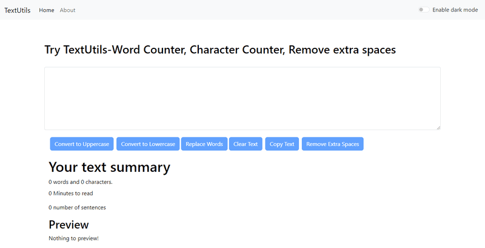
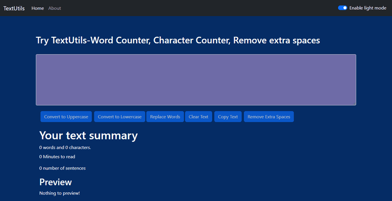

# TextUtils: Simplify Your Text Editing

📄 Welcome to **TextUtils**, a React-based web application designed to streamline text manipulation. With features like word and character counting, dark/light mode, text conversion, word replacement, and extra space removal, TextUtils is your ultimate tool for text editing. Below you will find detailed instructions on how to use the application and information on the available features.

## Table of Contents

1. [Introduction](#introduction)
2. [Features](#features)
   - [Word & Character Counting](#word--character-counting)
   - [Text Conversion](#text-conversion)
   - [Word Replacement](#word-replacement)
   - [Extra Space Removal](#extra-space-removal)
   - [Dark/Light Mode](#darklight-mode)
   - [Responsive Design](#responsive-design)
3. [Installation](#installation)
4. [Usage](#usage)
   - [General Instructions](#general-instructions)
5. [Contributing](#contributing)
6. [License](#license)
7. [Contact](#contact)

## Introduction

**TextUtils** is a powerful text manipulation platform built with React. It provides a suite of tools to help users perform common text-related tasks such as counting words and characters, converting text case, replacing words, removing extra spaces, and toggling between dark and light modes for a more comfortable user experience.

## Features

### Word & Character Counting

Easily count the number of words and characters in your text. This feature is perfect for writers, editors, and anyone who needs to manage text efficiently.

### Text Conversion

Convert your text to uppercase, lowercase, or capitalize the first letter of each word. This feature is useful for formatting text according to specific style guidelines.

### Word Replacement

Find and replace words in your text quickly and easily. This feature is helpful when you need to make bulk changes to specific words or phrases.

### Extra Space Removal

Automatically remove unnecessary spaces from your text with a single click, ensuring your text is clean and well-formatted.

### Dark/Light Mode

Toggle between dark and light themes for a comfortable reading and editing experience based on your preference. The selected theme is saved locally and applied on your next visit.

### User Interface Overview
1. **Main Layout**
Header: Contains the application title TextUtils prominently displayed, along with a navigation bar featuring links to different sections of the app (like usage instructions and contact info).
2. **Text Input Area**
Text Box: A large, editable text area where users can enter or paste their text. This area should be spacious for easy visibility and editing.
3. **Feature Buttons**
Below the text box, there are several buttons corresponding to the key features:
**Count Words & Characters**: A button that, when clicked, displays the count of words and characters in a prominent area.
**Convert Text**: Options (buttons or a dropdown) allowing users to choose between converting text to uppercase, lowercase, or capitalizing each word.
**Replace Words**: A button that opens a small modal or dropdown for users to input the word they want to find and the word to replace it with.
**Remove Extra Spaces**: A simple button that, when clicked, cleans up the text in the text box.
4. **Theme Toggle**
**Dark/Light Mode Toggle**: A switch (often a toggle button) located in the navbar that allows users to switch between dark and light themes seamlessly. The current theme is visually indicated.
5. **Output Display**
Word/Character Count Display: A small area beneath the buttons to show the current word and character count dynamically as the user types.
6. **Responsive Design**
The layout adapts to different screen sizes:
Desktop: Wider text area and button layout.
Tablet and Mobile: Stacked layout for buttons and a more compact text area to maintain usability on smaller screens.
Additional Considerations
Color Scheme: Ensure that the color scheme is visually appealing and provides good contrast, especially between the dark and light modes.
Accessibility: Use labels and ARIA roles to make the application accessible to all users, including those using screen readers.
User Feedback: Consider adding subtle animations or alerts when an action is performed, like successfully removing spaces or changing modes.





## Installation

To install and run this application locally, follow these steps:

1. **Clone the repository:**

   ```bash
   git clone https://github.com/YourUsername/TextApp-React.git

2. **Navigate to the project directory:**
   ```bash
   cd TextApp-React
   ```
3. **Install dependencies using npm:**
   ```bash
   npm install
   ```
4. **Start the development server:**
   ```bash
   npm start
   ```
5. **Open your web browser and navigate to:**
   ```bash
   http://localhost:3000
   ```
###   Usage
1. Open the app in your web browser.
2. Enter or paste your text into the text box.
3. Use the available buttons to perform the following tasks:
- Count Words & Characters: Get an instant count of words and characters in your text.
- Convert Text: Convert your text to uppercase, lowercase, or capitalize each word.
- Replace Words: Find and replace specific words or phrases in your text.
- Remove Extra Spaces: Clean up your text by removing unnecessary spaces.
- Toggle Dark/Light Mode: Switch between dark and light themes using the toggle switch in the navbar.


## Contributing

We welcome contributions to improve this application. Please follow these steps:

1. Fork the repository or clone it locally:
   ```bash
   git clone https://github.com/Armish11/TextApp-React.git
   ```
2. Create a new branch:
   ```bash
   git checkout -b feature-branch
   ```
3. Make your changes and commit them:
   ```bash
   git commit -m "Description of changes"
   ```
4. Push to the branch:
   ```bash
   git push origin feature-branch
   ```
5. Open a pull request on GitHub if you would like to propose your changes.


### License
This project is licensed under the MIT LICENSE. See the [LICENSE](./LICENSE)file for more details.

## Contact

If you have any questions, feedback, or suggestions, feel free to contact me on [GitHub](https://github.com/Armish11). I'll be happy to assist!


